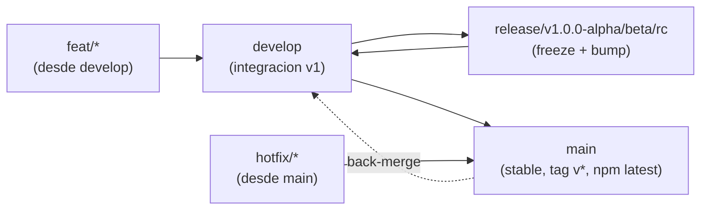

# Branch Workflow — Guia humana

> Para 4 devs, `lumen-cli` `v1.0.0` en train `alpha -> alpha.2 -> beta -> beta.2 -> stable` (ROADMAP.md M1-M5), paralelo a `create-lumen` `v2.0.0`. Ver ADR 0002 y PLAN.md.

## TL;DR

- **Nunca** pushees directo a `main` o `develop`.
- Crea `feat/*` desde `develop`, abre PR a `develop`.
- `release/*` solo la crea el release manager para congelar una version.
- `main` solo recibe `develop` (en `v1.0.0` estable) o `hotfix/*` (emergencia).
- Mismo flujo que `create-lumen` — cambia solo el versionado (`v1.0.0-*` vs `v2.0.0-*`).

## El grafo



## Ramas

| Rama | Para que | Quien la toca | Cuanto vive |
|------|----------|---------------|-------------|
| `main` | Lo que ve el usuario (`npx lumen`, `npm@latest` tras `v1.0.0`). | Solo via PR desde `develop` o `hotfix/*` | Para siempre |
| `develop` | Donde integramos los 4 devs. Siempre verde. | Todos, via `feat/*`/`release/*` | Para siempre |
| `release/v1.0.0-alpha` | Foto congelada para estabilizar. Se bumpa `package.json` y `CHANGELOG.md`. Solo entran `fix` criticos. | Release manager | Dias/semanas |
| `feat/g-feature` | Tu feature (ej `feat/gen-feature`, `feat/python-bridge`). | Tu | Dias, se borra al mergear |
| `hotfix/1.0.1` | Emergencia en `main` tras `v1.0.0`. Se crea desde `main`, se mergea a `main` y luego a `develop`. | Quien arregla | Horas |

## Nombres

- `feat/<scope>-<descripcion>` ej `feat/cli-bootstrap`, `feat/gen-core`, `feat/g-ui`
- `fix/<descripcion>` ej `fix/config-reader`
- `release/v1.0.0-alpha`, `release/v1.0.0-alpha.2`, `release/v1.0.0-beta`, `release/v1.0.0-rc`, `release/v1.0.0`
- `hotfix/<version>` ej `hotfix/1.0.1`

Commits: Conventional Commits — `feat:`, `fix:`, `chore(release):`, `docs:`, `ci:`.

## Como trabajar (paso a paso)

### 1. Empezar una feature (todos los dias, 4 devs en paralelo)

```bash
git checkout develop
git pull origin develop
git checkout -b feat/mi-feature
# ... codifica ...
npm test  # cuando exista (M1 #1)
git add -A && git commit -m "feat: mi feature"
git push -u origin feat/mi-feature
# Abre PR en GitHub: feat/mi-feature -> develop, espera review + CI verde
```

> Regla: `feat/*` siempre nace de `develop`, nunca de `release/*`. Asi los 4 devs no se bloquean.

### 2. Sacar un alpha/beta/rc (solo release manager)

Cuando `develop` alcanza el DoD de un milestone (M1: `npx lumen create my-app` funciona):

```bash
git checkout develop && git pull
git checkout -b release/v1.0.0-alpha
# bump de version
npm version 1.0.0-alpha --no-git-tag-version
# actualiza CHANGELOG.md [Unreleased] -> [1.0.0-alpha]
git commit -am "chore(release): 1.0.0-alpha"
git push -u origin release/v1.0.0-alpha
# Solo fixes criticos desde ahora:
git checkout -b fix/ajuste release/v1.0.0-alpha -> PR fix/* -> release/*
# Cuando verde:
# PR release/v1.0.0-alpha -> develop (mergea, preserva bump)
# Tag: git tag v1.0.0-alpha && git push origin v1.0.0-alpha
# publish.yml publica con npm publish --tag alpha y crea GitHub Release --prerelease
```

Dist-tags: `alpha` -> `npm create lumen@alpha` (via `lumen-cli@alpha`), `beta` -> `@beta`, `rc` -> `@rc`, `next` -> generico, `latest` -> estable.

### 3. Release estable `v1.0.0` (M5)

```bash
# develop ya tiene M1-M4
git checkout main && git pull
git merge develop --no-ff -m "chore(release): 1.0.0 stable"
# o PR develop -> main en GitHub
npm version 1.0.0 --no-git-tag-version
git tag v1.0.0 && git push origin main --tags
# publish.yml: npm publish (latest) + GitHub Release
```

### 4. Hotfix (solo si `main` tiene regression y no puede esperar a `develop`)

```bash
git checkout main && git pull
git checkout -b hotfix/1.0.1
# fix
git commit -m "fix: ..."
git push -u origin hotfix/1.0.1
# PR hotfix/1.0.1 -> main (tag v1.0.1), luego back-merge:
git checkout develop && git merge main
git push origin develop
```

## SemVer en 30 segundos

- `fix:` -> `1.0.1` (patch)
- `feat:` aditivo -> `1.1.0` (minor)
- Romper CLI/config -> `2.0.0` (major)
- `lumen-cli` `v1.0.0` habla `create-lumen` `v2` manifest only (ROADMAP.md).

## Coordinacion con create-lumen

| Hito | create-lumen | lumen-cli | Nota |
|------|--------------|-----------|------|
| M1 alpha | `v2.0.0-alpha` | `v1.0.0-alpha` | `lumen-cli#3`/`#5` desbloqueados |
| M2 alpha.2 | `v2.0.0-alpha.2` | `v1.0.0-alpha.2` | Generators |
| M3 beta | shadcn/ui `#33` | `v1.0.0-beta` | `g ui` |
| M5 stable | `v2.0.0` | `v1.0.0` | Ambos `latest` |

## Checklists

**Antes de abrir PR a `develop`:**
- [ ] `git pull --rebase origin develop`
- [ ] `npm test` verde (cuando exista)
- [ ] `npx eslint .` verde (cuando exista)

**Antes de crear `release/*`:**
- [ ] `develop` verde en CI
- [ ] DoD del milestone cumplido (ROADMAP.md)
- [ ] `package.json` y `CHANGELOG.md` bumpeados

## Do / Don't

- DO: rebases frecuentes, PRs pequenos, borrar `feat/*` tras merge.
- DON'T: `feat -> release/*`, `feat -> main`, push directo a `main`/`develop`, dos `release/*` activas a la vez, dejar `release/*` sin back-merge a `develop`.

## Referencias

- ADR 0002: `docs/adr/0002-branching-strategy.md`
- Versionado: `docs/ROADMAP.md`
- Plan: `docs/PLAN.md`
- CI: `.github/workflows/publish.yml`, `.github/workflows/eslint.yml`
