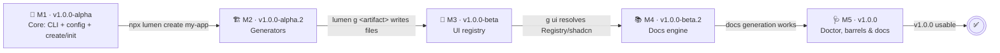
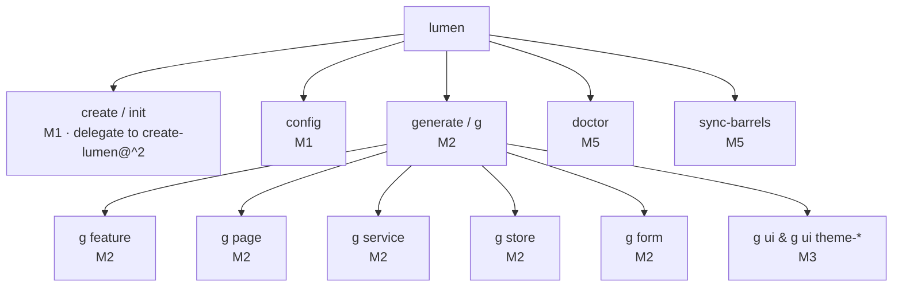
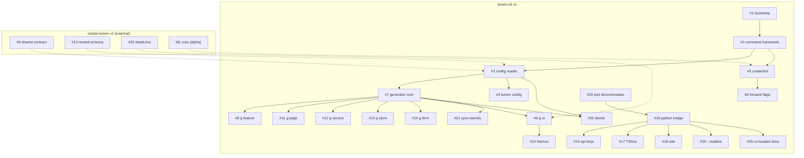
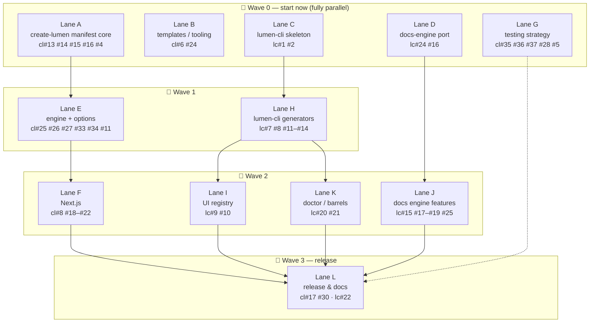
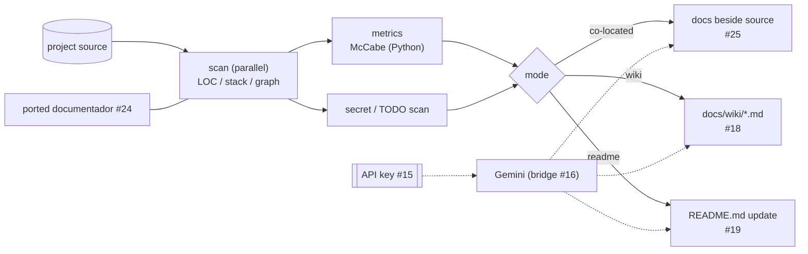
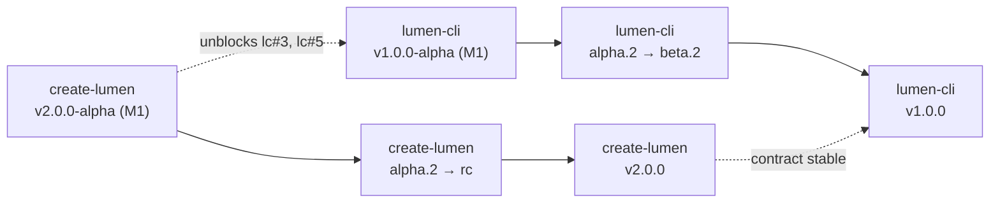

# v1 Plan — diagrams

Visual companion to [`ROADMAP.md`](../ROADMAP.md). `lc#` = `lumen-cli`,
`cl#` = `create-lumen`. All diagrams render on GitHub.

## 1. Functional milestones

## 2. Target command surface

What the CLI exposes at `v1.0.0` (a command appears as its milestone
lands).

## 3. Dependency graph (lumen-cli + cross-repo)

Solid = hard dependency. Dotted = dependency on `create-lumen`.

## 4. Cross-project waves (4 devs)

Everything in a wave can run at the same time; lanes are shared with
`create-lumen`.

Suggested split: **Dev 1** A→E→F · **Dev 2** B→G→L · **Dev 3**
C→H→I→K · **Dev 4** D→J.

## 5. Docs-engine pipeline (M4)

## 6. Release train & cross-project ordering

